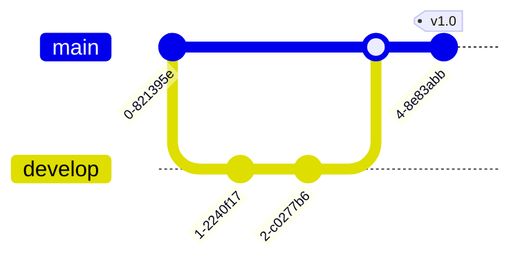

# Mermaid Diagram Expert

**Comprehensive Mermaid.js solution for visualization and documentation**

> **Version**: 5.0.0  
> **Focus**: Flowcharts, Sequence, Class, ER, Gantt, C4, Architecture  
> **Tools**: Mermaid CLI, Python Converter

---

## Quick Start

### Installation

```bash
# Install Mermaid CLI
npm install -g @mermaid-js/mermaid-cli

# Convert diagram
mmdc -i diagram.mmd -o output.png
```

### Python Converter (Custom)

```python
# scripts/mermaid-to-svg-png.py
import sys
import subprocess

def convert(input_file, output_file, format='png'):
    cmd = ['mmdc', '-i', input_file, '-o', output_file]
    if format == 'png':
        cmd.extend(['-b', 'transparent'])
    subprocess.run(cmd, check=True)

if __name__ == '__main__':
    convert(sys.argv[1], sys.argv[2])
```

---

## Core Diagram Types

### 1. Flowchart

Process flows and decision trees.


### 2. Sequence Diagram

Actor interactions and API flows.


### 3. Class Diagram

OOP architecture and data modeling.


### 4. Entity Relationship (ER)

Database schema and relationships.


### 5. Gantt Chart

Project timelines and schedules.


### 6. State Diagram

State machines and lifecycle.


### 7. C4 Architecture

System context and container diagrams.


### 8. Git Graph

Version control history.



### 9. Mindmap

Hierarchical knowledge structure.


### 10. User Journey

User experience flows.


---

## Advanced Features

### Styling & Theming


### Subgraphs


---

## Best Practices

1.  **Keep it Simple**: Limit nodes to <20 for readability.
2.  **Direction**: Use `TD` (Top-Down) for hierarchies, `LR` (Left-Right) for flows.
3.  **Styling**: Use classes for consistent styling across nodes.
4.  **Version Control**: Commit `.mmd` files, generate images in CI.

---

## Validation Checklist

- [ ] Syntax valid (renders in editor)
- [ ] Direction appropriate for content
- [ ] Labels clear and concise
- [ ] Colors used for semantic meaning
- [ ] Complex logic broken into subgraphs

---

## Related Skills

- `moai-project-documentation`: Documentation standards
- `moai-domain-frontend`: UI visualization
- `moai-domain-backend`: API & DB modeling

---

**Last Updated**: 2025-11-20
